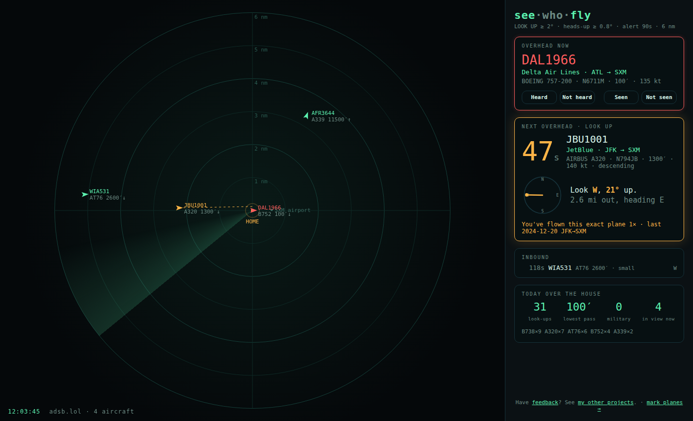
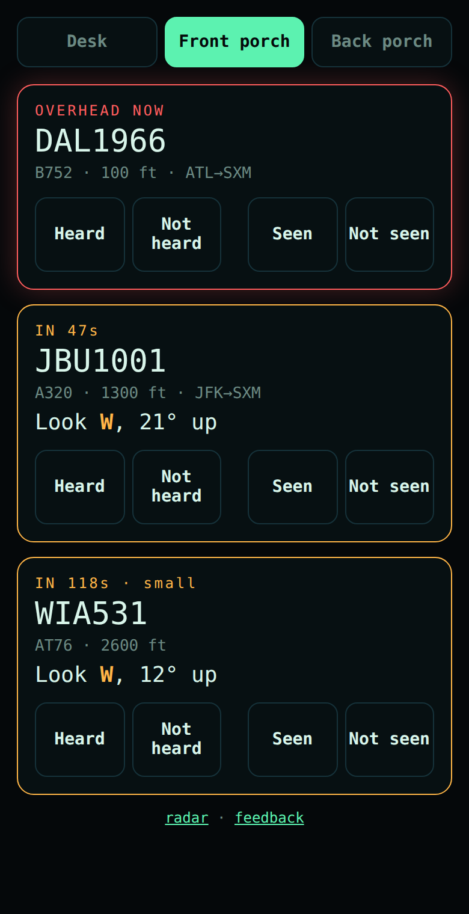

# see-who-fly ✈️

**A live radar screen of the planes about to fly over your house, with a countdown so you can step outside and look up.**



*Demo screenshot at the default example location, Maho Beach, St. Maarten (the famous low-landing beach).*

Have feedback? → **[Tell me here](https://theonenonlyvj.github.io/personal-site/contact)** · More projects → **[theonenonlyvj.github.io/personal-site](https://theonenonlyvj.github.io/personal-site)**

---

## What it does

- **Radar view.** Every aircraft within a few miles of your spot, moving smoothly, with trails.
- **LOOK UP vs heads-up.** Planes are judged by *how big they'll look* from where you stand (wingspan over 3-D distance), not by a fixed box. A C-17 a mile away counts; a 737 at 35,000 ft never does.
- **Overhead Now.** A big red card while a plane looks big right above you. It stays up, greyed out as "just passed", for 90 seconds afterwards (planes are often still audible after they stop looking big), so you can still mark it. In busy traffic the next big plane takes the card, so `/look` on your phone is the place to mark: it lists every plane that just passed.
- **Next Overhead.** A countdown (alert 90 s out, enough time to get outside), plus which way to look ("Look SE, 21° up"), the airline, route, aircraft type and altitude.
- **"You've flown this plane."** If you give it your [Flighty](https://flighty.com/) export, it tells you when a plane overhead is one you've actually flown on, matched by tail number.
- **Military flag.** Military aircraft get a blue color and a **MIL** badge.
- **Mark what you noticed.** Open `/look` on your phone: pick **Desk / Front porch / Back porch**, then tap **Heard / Not heard** and **Seen / Not seen** for each plane. Each is optional, so unmarked never means "no", and "Not seen" means you looked and couldn't spot it. The marks are saved so the thresholds can be tuned to what you actually see and hear. Every plane within 2 miles is listed there too ("Nearby"), so you can mark one you heard even if the screen didn't flag it.
- **Overhead today, by type.** Airline, private plus (business jets), private (small planes), cargo, helicopter, military: how many were worth looking up at, out of how many passed nearby.
- **More about each plane.** A photo when one exists, who owns it, engines and wingspan, and live numbers in plain units (ft above you, mph, climb/descent).
- **Landing at your airport.** When the route lists don't know a flight, a plane on approach to a local airport is shown as "→ SXM (landing)" (any place in your places file with an `iata` code counts as a local airport).
- **Where it took off from.** For planes no route list knows (private jets, charters), the plane's own public track for the day shows where its current leg began, e.g. "TUL → SXM (landing)" or "from TUL". No answer if the track starts mid-air or isn't next to an airport.
- **Today's stats.** How many planes passed over, the lowest pass, the military count and the type mix. Every pass is saved to a log file, so the stats survive restarts.

No radio or antenna is needed. It uses free, public, crowd-sourced aircraft data ([adsb.lol](https://adsb.lol), [adsb.fi](https://adsb.fi)).

## Quick start (about 2 minutes)

You need [Node.js](https://nodejs.org) 18 or newer. There is nothing else to install.

```bash
git clone https://github.com/theonenonlyvj/see-who-fly.git
cd see-who-fly
npm start
```

Open **http://localhost:8093**. Out of the box it shows the example location (Maho Beach).

### Point it at your house

1. Copy `config.example.json` to somewhere **outside** this folder, for example `~/see-who-fly-home.json`.
2. Put in your latitude and longitude. To find them, right-click your house in Google Maps and click the numbers.
3. Start it with that file:

```bash
SEE_WHO_FLY_HOME_CONFIG=~/see-who-fly-home.json npm start
```

### Put it on a TV

Open **http://YOUR-COMPUTER-IP:8093/** in the TV's web browser (start the server with `SEE_WHO_FLY_HOST=0.0.0.0` as below). It's the same page as on a computer. The main page uses modern JavaScript; older smart-TV browsers (built for a 2018 Samsung, Chromium 56) are recognised and get a copy of the same page built for them, which is also always at **/tv**. Turn off the TV's auto power-off if you want it on all day, and mind burn-in on OLED screens.

### Use it from your phone

1. Start it so other devices on your Wi-Fi can reach it:

```bash
SEE_WHO_FLY_HOST=0.0.0.0 SEE_WHO_FLY_HOME_CONFIG=~/see-who-fly-home.json npm start
```

2. Find your computer's local IP address. On a Mac, hold Option and click the Wi-Fi icon. On Windows, run `ipconfig`. On Linux, run `hostname -I`. It looks like `192.168.1.23`.
3. On your phone, open **http://192.168.1.23:8093/look** (with your IP) and add it to your home screen.



Passes and marks are saved in `~/.see-who-fly/data` unless you set `SEE_WHO_FLY_DATA_DIR`.

Keep personal files out of the repo folder; `.gitignore` also blocks the usual names. Your location stays on your machine. The browser only receives positions *relative* to home, never your coordinates.

### Settings (in your home config file)

| key | default | meaning |
|---|---|---|
| `lat`, `lon` | — | your spot |
| `tz` | your computer's | time zone for "today" and clocks, e.g. `America/New_York` |
| `ground_elev_ft` | 0 | your ground elevation in feet above sea level (look it up once; it makes heights and angles accurate) |
| `view_radius_nm` | 6 | how far the radar shows, in nautical miles |
| `lookup_deg` | 2.0 | apparent size (degrees) for **LOOK UP** |
| `heads_deg` | 0.8 | apparent size for **heads-up** (visible but small) |
| `alert_lead_s` | 90 | how many seconds ahead a plane turns amber |
| `overhead_hold_s` | 90 | how long a plane stays on the Overhead Now card (as "just passed") after it stops looking big |
| `near_mi` | 2 | planes within this distance are listed as "Nearby" on `/look` for marking |
| `log_within_mi` | 2 | planes passing closer than this get saved to the log (big ones farther out are saved too) |
| `feed_radius_nm` | 10 | how far out to ask the feed for planes (wider than the radar, for earlier warnings) |

### Optional extras (environment variables)

| variable | what it does |
|---|---|
| `SEE_WHO_FLY_PLACES` | a JSON file of landmarks to draw, e.g. `[{ "name": "Airport", "lat": .., "lon": .. }]` (see `places.example.json`) |
| `SEE_WHO_FLY_FLIGHTY_DIR` | a folder with your Flighty exports; the newest `FlightyExport-*.csv` is used |
| `SEE_WHO_FLY_DATA_DIR` | where to save the pass log (`passes-YYYY-MM-DD.jsonl`) and marks (`marks-YYYY-MM-DD.jsonl`); default `~/.see-who-fly/data` |
| `SEE_WHO_FLY_HOST`, `SEE_WHO_FLY_PORT` | where to serve; use `0.0.0.0` to open it from your phone on home Wi-Fi |
| `SEE_WHO_FLY_ALLOWED_HOSTS` | extra hostnames to answer to, comma-separated (IP addresses and `localhost` always work) |

> ℹ️ **Lookups:** callsigns and aircraft hex codes for planes in view are sent to adsbdb and the VRS route lists (for routes and owners), and photos of the planes shown on screen are fetched from airport-data.com. Like the flight feeds themselves, these services can roughly tell the area you're watching.

> ⚠️ **Keep it on your home network.** Don't port-forward it or put it on the internet. The browser never gets your coordinates (the free flight feeds do see the point you ask about, which is how they work), but the plane positions *relative to you*, combined with public flight data, would give away where you are.

## How it works (short version)

1. The server asks a free aircraft feed for everything within about 10 nm of you, every 2 seconds while a screen is open and every 5 seconds otherwise.
2. For each plane, it projects heading, speed and climb/descent forward (climb/descent only for a minute; planes about to land are ignored) and works out how big the plane will look at its closest point. That gives a tier (LOOK UP / heads-up / nothing), a countdown to when it starts looking big, and which way to look *at that moment*.
3. It looks up the flight number's route list ([VRS standing data](https://github.com/vradarserver/standing-data) via adsb.lol, with [adsbdb](https://www.adsbdb.com) for the airline name and as a fallback). Airlines reuse a flight number for several legs a day, so it shows only the leg that fits what the plane is doing (landing here, taking off here, or cruising along that leg's path), and just the airline when nothing fits. These are community route lists, not live flight plans. It also checks the tail number against your Flighty history, locally.
4. When a plane has gone by, its closest approach is worked out between updates (so a slow poll can't miss it) and saved to the log.

## For agents and contributors

- **No runtime dependencies.** It's plain Node (ESM) and a static `public/` front end (HTML/CSS/canvas). The browser code is modern JavaScript; `npm run build:tv` lowers it with esbuild into the committed `public/tv/` copy (plus `tv.html`, `tv-look.html`) for old TV browsers. Run it after changing `public/*.js` or the HTML; a test fails if the copy is stale. `npm run build:airports` rebuilds `lib/airports.json` from OurAirports.
- **Layout:** `server.mjs` handles HTTP, polling and wiring. `lib/geo.mjs` has the local frame and segment closest-approach. `lib/visibility.mjs` has the wingspans, apparent size and tier prediction. `lib/marks.mjs` handles heard/seen marks. `lib/passlog.mjs` has the pass tracker, daily summary and JSONL log. `lib/flighty.mjs` finds the newest export, parses the CSV and matches tail or flight. `lib/places.mjs` loads landmarks and filters them to the window. `lib/origin.mjs` finds where a flight took off from its public track. `lib/hold.mjs` keeps a plane that just passed on screen. `public/` holds `index.html`, `app.js` and `style.css`.
- **Tests:** `npm test` (Node's built-in runner, `test/*.test.mjs`). Add a test for any change to prediction or logging.
- **API:** `POST /api/mark` `{hex, callsign, spot: desk|front|back, heard: true|false|null, seen: true|false|null}`. `GET /api/state` returns aircraft (relative `x`/`y` metres, tier, ETA, apparent size, marks, route, flown match, military flag), landmarks (relative), today's summary and a `build` id. Open screens reload when `build` changes.
- **Invariants:** never commit real home coordinates, private places, pass logs or Flighty exports, and never send home lat/lon to the browser. Be polite to the free feeds: keep the poll intervals and the backoff.

## Keywords

`ads-b` · `adsb` · `flight-tracker` · `plane-spotting` · `planespotting` · `aircraft` · `aviation` · `radar` · `overhead` · `flights-over-my-house` · `what-plane-is-that` · `flighty` · `tail-number` · `military-aircraft` · `home-dashboard` · `raspberry-pi` · `real-time` · `nodejs` · `no-dependencies` · `adsb-lol` · `adsb-fi` · `adsbdb`

## Credits

Aircraft positions: [adsb.lol](https://adsb.lol) and [adsb.fi](https://adsb.fi) (community-fed, open data). Routes: [VRS standing data](https://github.com/vradarserver/standing-data) (mirrored by adsb.lol) and [adsbdb](https://www.adsbdb.com). Where a flight took off: adsb.lol's public traces. Airports: [OurAirports](https://ourairports.com/data/) (public domain). Icon: airplane from [OpenMoji](https://openmoji.org), the open-source emoji and icon project, [CC BY-SA 4.0](https://creativecommons.org/licenses/by-sa/4.0/), adapted (see `public/ICONS.md`). Part of Vijay's VGames side projects. [Feedback welcome](https://theonenonlyvj.github.io/personal-site/contact).
